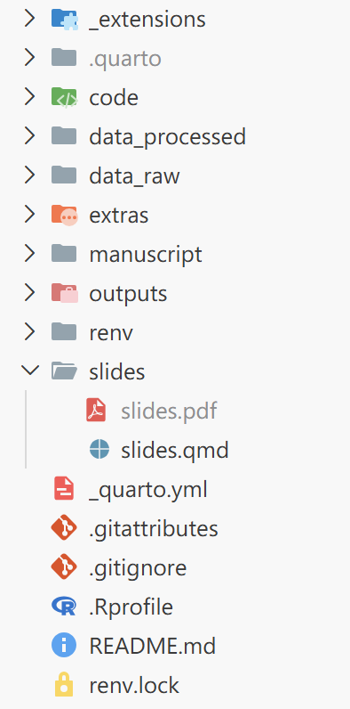
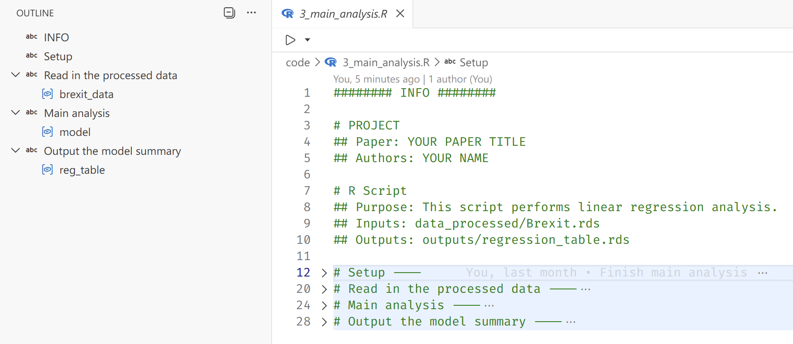
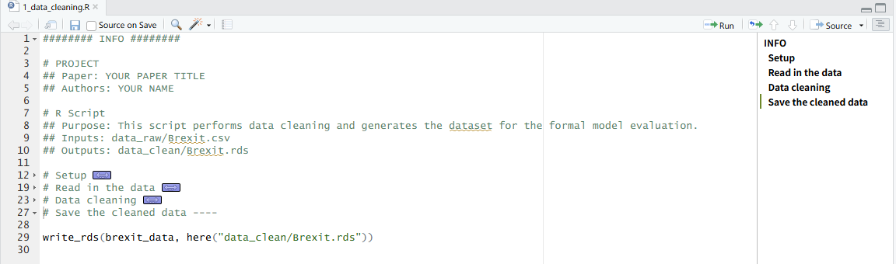
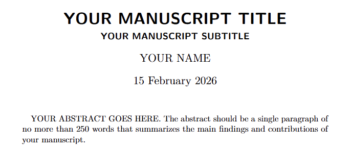
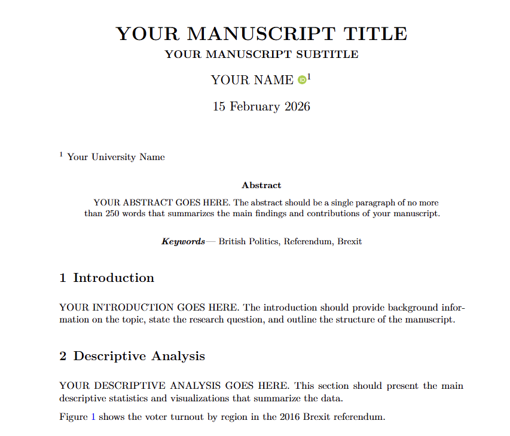
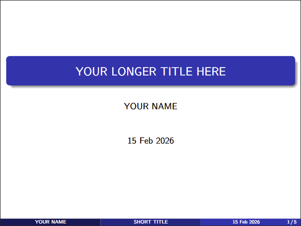

Increasingly, academic disciplines, including the social sciences, are adopting data-science tools and calling for greater transparency and reproducibility in research. Many leading journals now require authors to share the data and code necessary to replicate published findings as a condition of publication.

Yet preparing replication materials can be daunting, especially for researchers new to data science. It is not uncommon for scholars to struggle to reproduce even their own results, due to issues such as disorganized code and data, software version mismatches, missing random seeds, or differences in operating systems and platforms. While some of these challenges are complex, many reproducibility problems stem from preventable organizational issues. Structuring code and data in a clear, consistent, and tool-friendly manner can significantly reduce these difficulties — and brings additional benefits at virtually no cost, including smoother collaboration and easier integration with AI tools.

{width="60%"}

In this post, I’ll walk through the project structure I use in my own research. It has evolved over time and reflects what I currently consider best practice for reproducible academic work. Adopting a clear structure from the outset makes it significantly easier to reproduce results, onboard collaborators, and maintain projects over the long term.

The structure covers the full research lifecycle: from data cleaning and analysis to manuscript preparation and presentation. The template is built around R and Quarto (the successor to R Markdown), but the underlying principles translate easily to Python and other publishing workflows, including LaTeX. For convenience, I’ve created a ready-to-use template on [GitHub](https://github.com/kv9898/academic-project-template) that you can clone and adapt for your own projects.

The project structure looks like this:



I’ll now break down each component in turn, explaining the purpose of the key folders and files, and the reasoning behind the design.

# Git and GitHub

One major threat to reproducibility is a file named `latest_final_v3_definitive.R`. While this naming convention feels natural during exploratory analysis—especially under deadline pressure—it quickly becomes impossible to reconstruct what actually changed, when, and why. Future-you (and your collaborators) will not be grateful.

Version control systems like Git solve this problem by recording a structured history of changes through *commits*. Instead of creating new files for every iteration, you preserve a single evolving project with a transparent timeline. This makes it easy to revisit earlier versions, understand how results evolved, and collaborate without overwriting each other’s work.

GitHub builds on this by providing a shared platform for hosting repositories, reviewing changes, managing issues, and coordinating collaboration. It also makes it very clear who introduced a particular change—an accountability feature that tends to concentrate the mind when committing code.

In the example project structure, several files and folders are Git-related:

```         
.git/ (invisible folder created by Git)
.gitignore
*.gitattributes
*/
└── .gitignore
```

The `.git/` folder is created automatically when you initialize a repository. It contains the full version history and metadata of the project. You generally do not need to interact with it directly—just avoid modifying or deleting it.

The `.gitignore` file specifies which files and folders should be tracked or ignored by Git. Since all changes to tracked files are recorded in the project history, a useful rule of thumb is to track only what is necessary to reproduce your results. Files that can be regenerated from code—such as intermediate data, plots, tables, or compiled PDFs—are often better ignored to keep the repository clean and lightweight.

The `.gitattributes` file defines additional rules for how Git should handle specific file types. Compared with `.gitignore`, it appears less often in many repositories, but it is especially useful when you need file-type-specific behavior. In particular, large raw data files (e.g., large .csv files) and binary formats (such as .rds, .RData, or images) can significantly increase repository size if tracked directly. In these cases, Git Large File Storage (Git LFS) can be used to store the actual files separately, while keeping lightweight pointer files in the main repository history.

# Data directories

I use two separate folders to store raw (`data_raw/`) and cleaned data (`data_processed/`). Keeping these distinct makes the workflow more transparent: the original data remains untouched, while processed data can be saved in a format that is fast to load during analysis.

This structure also aligns with common journal expectations that replication code should be able to reproduce results starting from the raw data. By preserving raw inputs and separating preprocessing steps, you make the transformation pipeline explicit rather than implicit.

```         
data_raw/
└── *.csv (tracked through Git LFS)

data_processed/
├── *.rds (not tracked in Git)
└── .gitignore
```

In the template, the example raw data file (`data_raw/Brexit.csv`) is tracked using Git LFS. While the file itself is neither large nor binary (unlike formats such as `.dta` or `.rds`), LFS is used here for demonstration purposes. In real-world research projects, raw datasets are often substantial in size, and setting up LFS early helps avoid repository bloat later on.

The `data_processed/` folder contains the cleaned dataset in `.rds` format, along with a `.gitignore` file that excludes all files in this folder (except the `.gitignore` file itself) from version control. This design encourages regeneration of cleaned data from raw inputs via code, rather than relying on previously saved intermediate objects. It also helps keep the repository lightweight.

The `.rds` format is used for several reasons. First, it is a native R format that preserves data types and attributes faithfully. Second, it encourages the use of RDS over `.RData`. Unlike `.RData`, which loads all stored objects into the global environment under their *original* names, `.rds` files require explicit assignment when loaded. This reduces the risk of unintentionally overwriting existing objects and promotes more transparent workflows.

Finally, the `.gitignore` file inside `data_processed/` serves an additional purpose: it ensures that the folder itself is tracked by Git. Since Git does not record empty directories, this placeholder guarantees that the directory exists when the project is cloned. This is important because saving cleaned data to a non-existent directory will otherwise result in an error in R.

For researchers working with **confidential** or **restricted** data, it is often helpful to separate sensitive materials from those that can be shared publicly. In some cases, this may mean maintaining a private repository during the research phase and preparing a separate public-facing repository upon publication.

Importantly, simply deleting confidential files before making a repository public is not sufficient. Git preserves the full commit history, meaning sensitive data may still be accessible in earlier revisions. Creating a fresh repository that contains only the materials intended for public release—such as replication code and non-sensitive data—helps prevent unintended data leakage.

This approach also makes it easier to curate a clean, well-documented version of the project specifically designed for replication and reuse.

# Code organization and outputs

```         
code/
├── 1_data_cleaning.R
├── 2_descriptive.R
└── 3_main_analysis.R

outputs/
├── *.rds (not tracked in Git)
└── .gitignore
```

The `code/` folder contains all scripts related to data processing and analysis. In the template, these are written in R, but the same structure works equally well for Python scripts (`.py`), notebooks (`.ipynb`), or other programming languages.

A key principle is to prefix scripts with numbers and descriptive names that reflect the research workflow: data cleaning, descriptive analysis, and then inferential analysis. If the logical order of steps is unclear, following the sequence in which results appear in the manuscript is often a reliable guide. This makes the analytical pipeline explicit and allows others (and future-you) to reproduce results step-by-step.

Each script should include a header section with basic metadata about its role in the project. This may include the paper title, authors, purpose of the script, input files, and output files. Making inputs and outputs explicit helps clarify dependencies and encourages scripts that transform data rather than rely on objects lingering in the global environment.

Below is an example of an analysis script (`code/3_main_analysis.R`) I used in the template that follows these principles:

``` r
######## INFO ########

# PROJECT
## Paper: YOUR PAPER TITLE
## Authors: YOUR NAME

# R Script
## Purpose: This script performs linear regression analysis.
## Inputs: data_processed/Brexit.rds
## Outputs: outputs/regression_table.rds

# Setup ----

library(tidyverse)
library(here)
library(modelsummary)

i_am("code/3_main_analysis.R") # helps with relative paths

# Read in the cleaned data ----

brexit_data <- read_rds(here("data_processed/Brexit.rds"))

# Main analysis ----

model <- lm(leave ~ turnout + income + noqual, data = brexit_data)

# Output the model summary ----

reg_table <- modelsummary(model, stars = TRUE, output = "latex")
write_rds(reg_table, here("outputs/regression_table.rds"))
```

Two additional tips are worth noting. First, the `# SECTION ----` syntax creates collapsible sections and structured outlines in RStudio and the Positron IDE. This makes longer scripts significantly easier to navigate and encourages more intentional organization of code.





Second, managing working directories is a seemingly basic task that is frequently mishandled—especially in collaborative projects. In RStudio, the recommended approach is to work within an `.Rproj` file, which defines a project root and ensures that relative paths behave consistently across machines. However, in many academic settings (including political science), this practice is not systematically taught. As a result, it is still common to see replication files from top journals that begin with something like `setwd("~/Path/To/Project")`, often commented out with the expectation that collaborators will manually adjust it.

This approach is fragile. It assumes a specific directory structure on every machine and introduces hidden dependencies on local file paths. Code that depends on `setwd()` is difficult to port, share, or automate.

Positron improves this situation by automatically setting the working directory to the folder opened in the IDE, encouraging a project-level workflow by default. However, many users carry over the habit of opening individual scripts rather than entire project directories.

The `here` package provides a robust solution that avoids reliance on the working directory altogether. By anchoring a script to the project root using `here::i_am()` and constructing paths with `here()`, file references become explicit and portable. This ensures that scripts run consistently across machines, IDEs, and collaboration environments—regardless of local directory structures.

The `outputs/` folder complements this approach by providing a dedicated location for all results generated by the code. This includes intermediate objects (e.g., fitted models) and final products (e.g., tables and figures). If intermediate artifacts become numerous, they can be stored in a separate `objects/` folder. The accompanying `.gitignore` file ensures that these generated files are not versioned, reinforcing the principle that results should be regenerated from code rather than preserved as static artifacts.

# Virtual environments and dependencies (`renv`)

Many R users do not update their R or package versions regularly. In practice, the version in use is often determined by when the researcher first learned R—or when the machine was purchased, whichever is later. Deprecation warnings are politely ignored as long as the code continues to run.

The problem only becomes visible when code that worked perfectly on your old machine suddenly fails on a new machine—or worse, on a collaborator’s machine. At that point, dependency management stops being an abstract concern and becomes a very practical one.

A common solution to this problem is the use of **virtual environments**, which capture the exact package versions used in a project—a concept long established in the Python ecosystem. In R, the `renv` package provides a convenient way to create and manage project-specific libraries. Package versions remain fixed within the project, independent of updates to the global R installation or differences across collaborators’ machines.

The state of the environment is recorded in the `renv.lock` file, which is committed to Git. This file serves as a snapshot of the project’s dependency graph at a given point in time, including package versions and their sources. As a result, the same software environment can be reproduced on any machine with a simple call to `renv::restore()`.

Three key components related to `renv` appear in the template structure:

```         
renv/
.Rprofile
renv.lock
```

The `renv/` folder contains the project-specific package library. Most of its contents are not tracked in Git, since the environment can be regenerated from the information stored in `renv.lock`. Additionally, some packages include compiled C or C++ code that is platform-specific, meaning those installed binaries are not portable across operating systems.

The `.Rprofile` file includes a line that automatically activates the `renv` environment when the project is loaded, ensuring that the correct package versions are used without manual setup.

Automatic activation, however, only works when the project is **opened as a whole**—for example, by opening the `.Rproj` file or the project folder in Positron. If individual scripts are opened in isolation, the working directory will not be set to the project root at startup, and the project-level `.Rprofile` will not be executed. This is yet another reason to adopt a project-level workflow rather than treating scripts as standalone files.

# Quarto: manuscripts and presentations

The most visible stage of the research lifecycle is the dissemination of results—through manuscripts, presentations, and other public outputs. For quantitatively oriented researchers (which, if you have read this far, likely includes you), producing well-formatted documents that do justice to your carefully constructed tables and figures is essential.

Quarto is an open-source scientific and technical publishing system built on Pandoc. I use it for all of my manuscript writing and presentation slides, and I recommend it for researchers working in R, Python, or Julia. The template presented here is deliberately centered around Quarto, and in what follows I will briefly explain the reasoning behind that choice.

## Why Quarto?

What makes Quarto stand out is its ability to run R, Python, or Julia code directly within a document, seamlessly integrating analysis and writing. Tables, figures, and results can therefore be generated and updated automatically as the underlying code changes, ensuring that the manuscript always reflects the current state of the analysis.

Quarto is not a replacement for output formats such as HTML, Microsoft Word, LaTeX, or Typst. Rather, it acts as a *unifying* layer that can render the same `.qmd` source file into multiple formats simultaneously. This flexibility allows format decisions to be postponed and adapted to collaborators, institutions, or journal requirements.

Beyond manuscripts, Quarto also supports presentation formats and full websites. Learning a single tool therefore enables the production of academic papers, conference slides, and project or personal websites within a consistent workflow.

While these capabilities may sound familiar to experienced R Markdown users, I would still argue that Quarto is worth trying—even for those already comfortable with R Markdown—for four main reasons:

1.  **Language-agnostic support**: Quarto is designed to work seamlessly with multiple programming languages (R, Python, Julia). A document can be executed using the native engine for each language—for example, a Python-only document runs through a Jupyter kernel without requiring R[^1], which is more friendly to non-R users.

2.  **Native support for extended features**: Quarto includes built-in support for cross-referencing, citations, and advanced formatting without requiring additional packages or complex configurations. In contrast, R Markdown often relies on extensions such as `bookdown` to achieve similar functionality, which introduces additional dependencies. In practice, many students are taught only the basic R Markdown setup and may not be aware of these extensions. Quarto provides these features out of the box.

3.  **More scannable code cell/chunk options and syntax**: R Markdown users may be familiar with setting document-wide execution options inside a setup chunk using `knitr::opts_chunk$set(...)`, and specifying chunk options inline in a comma-separated format. While functional, this approach can become difficult to scan and maintain in larger documents.

    ```` markdown
    ```{{r}}
    knitr::opts_chunk$set(echo = FALSE, message = FALSE, warning = FALSE, error = FALSE)
    ```

    ```{{r barplot, fig.cap='Bar plot for y by x.', fig.height=3, fig.width=5}}
    # code for the bar plot
    ```
    ````

    In Quarto, document-level execution options are defined declaratively in YAML, while cell-level options use a multi-line, command-style syntax. This makes both levels of configuration easier to scan, and typically easier to review in diffs and modify.

    ```` markdown
    ```yaml
    execute:
      echo: false
      warning: false
      error: false
      message: false
    ```

    ```{{r}}
    #| label: fig-barplot
    #| fig-cap: 'Bar plot for y by x.'
    #| fig-height: 3
    #| fig-width: 5
    # code for the bar plot
    ```
    ````

4.  **Centralized documentation**: While R Markdown benefits from a large community and extensive online resources, its documentation is distributed across multiple sites[^2]. Quarto, by contrast, maintains a single, comprehensive [documentation portal](https://quarto.org) that covers core usage and advanced features in one place, making it easier to navigate and learn systematically.

[^1]: When R and Python are combined within the same document, however, Quarto uses reticulate under the hood, similar to R Markdown.

[^2]: For example, see [R Markdown official documentation](https://rmarkdown.rstudio.com/) for the core features, and [Yihui's personal site](https://yihui.org/rmarkdown/) for more advanced features.

## Quarto project structure

The remaining components of the template are primarily related to Quarto. Below, I break down the key elements and explain the reasoning behind their organization.

```
_extensions
.quarto (created by Quarto; not tracked in Git)
extras/
manuscript/
├── manuscript.pdf (not tracked in Git)
└── manuscript.qmd
slides/
├── slides.pdf (not tracked in Git)
└── slides.qmd
_quarto.yml
```

## Configuration file

The `_quarto.yml` file serves two main purposes.

First, it defines project-level execution behavior. In particular, the following setting ensures that code is executed relative to the project root, regardless of where individual .qmd files are located:

```yaml
project:
  execute-dir: project
```

This provides an additional layer of protection for resolving relative paths correctly. Used together with the here package, it helps ensure that file paths behave consistently across different machines and execution contexts.

Second, `_quarto.yml` centralizes shared configuration options so they do not need to be repeated in each individual `.qmd` file. This reduces duplication, minimizes the risk of inconsistencies, and improves readability across documents.

In the template, shared options include the bibliography file and citation style:

```yaml
bibliography: extras/references.bib
csl: extras/apa.csl
```

Because these settings are defined at the project level, they apply automatically to both the manuscript and presentation slides.

## Extras: bibliography and citation styles

As mentioned above, the `extras/` folder contains the bibliography file (`references.bib`) and citation style file (`apa.csl`). These are referenced in the `_quarto.yml` configuration file, which means they are automatically available to all `.qmd` files in the project without needing to specify them individually.

```
extras/
├── references.bib
└── apa.csl
```

Ideally, if you have other supplementary materials that are not part of the core code or data but are still relevant to the project (e.g., codebooks), they could also be stored in this folder. However, I have kept it focused on bibliography-related files for simplicity.

### Bibliography file

The `references.bib` file is a standard BibTeX/BibLaTeX bibliography file familiar to LaTeX users. It contains structured reference entries, including fields such as author, title, journal, year, and other publication metadata.

Entries can be exported from reference managers such as Zotero or Mendeley, or generated directly within Quarto using the Visual Editor. Crucially, the bibliography file is kept separate from both the manuscript and the citation style. This separation allows the same reference database to be shared across manuscripts and slides, while making it easy to change formatting styles without modifying the source content.

### Citation style file

The `apa.csl` file is a Citation Style Language (CSL) file that defines how citations and bibliography entries are formatted. It acts as a translation layer between the structured data in references.bib and the rendered output format.

In this template, the CSL file specifies APA style, which is common in the social sciences. However, switching styles is straightforward: replace the `apa.csl` file with another CSL file (e.g., Chicago, MLA, or a journal-specific style) and update the reference in `_quarto.yml`. No changes to the manuscript text are required.

To find a CSL file for a specific discipline or journal, you can browse the [CSL Style Repository](https://github.com/citation-style-language/styles)
, which contains thousands of maintained styles.

## Manuscript

Dissemination of research findings is the ultimate goal of the research process, and the manuscript remains its primary vehicle.

```
manuscript/
├── manuscript.pdf (not tracked in Git)
└── manuscript.qmd
_extensions/
└── kv9898/
    └── orcid/
```

The `manuscript/` folder contains the Quarto source file (`manuscript.qmd`) and the compiled PDF output (`manuscript.pdf`). As with other generated artifacts, the PDF is excluded from version control because it can always be regenerated from the source document.

The example `manuscript.qmd` provides a minimal template illustrating a typical academic structure, including numbered sections, figures, tables, cross-references, and citations. The template is intentionally simple but can be extended with additional formatting and structural elements as needed.

While Quarto’s built-in PDF format supports core elements such as title, authors, date, and abstract, more specialized academic requirements—such as detailed affiliation formatting, ORCID display, keywords, custom headers, or journal-style front matter—often require additional customization.



To address this, I created a [custom extension](https://github.com/kv9898/orcid) that builds on the default PDF format and adds features commonly required in academic manuscripts. The extension is included in the template under `_extensions/kv9898/orcid/`.

Packaging the manuscript format as a Quarto extension ensures that formatting logic is versioned and shared alongside the project, rather than maintained as ad hoc local tweaks. The extension is activated via the YAML front matter of manuscript.qmd:

```yaml
format:
  orcid-pdf:
```

The resulting PDF output more closely resembles a conventional academic paper, with structured author information, affiliations, ORCID identifiers, and keywords clearly presented. Because the template is implemented as a Quarto extension, it remains portable and reusable across projects, and can be further modified, particularly by those comfortable with LaTeX, to accommodate journal-specific formatting requirements.



## Slides

Researchers often need to present their findings at conferences, seminars, or in teaching settings. Quarto supports multiple presentation formats, including Reveal.js, Beamer, and PowerPoint. In this template, I use *Beamer* to produce PDF slides, which are widely accepted in academic contexts and easy to share or print.

```
slides/
├── slides.pdf (not tracked in Git)
└── slides.qmd
```

The `slides/` folder contains the Quarto source file (`slides.qmd`) and the compiled PDF output (`slides.pdf`). As with the manuscript, the PDF is treated as a generated artifact and excluded from version control.

The resulting slides are indistinguishable from those produced using a traditional LaTeX Beamer workflow. The key difference is that all content—including code, tables, and figures—can be generated directly from the same analytical pipeline.



In this example, I deliberately reuse the same output objects (e.g., tables and figures) in both the manuscript and the slides. This guarantees consistency across formats and eliminates the risk of discrepancies between what appears in the paper and what is presented publicly.

The example slides also demonstrate practical considerations such as resizing tables and figures to fit slide layouts. They reference the same shared bibliography file used in the manuscript, ensuring consistent citation formatting across outputs. Although only a single reference is included in the example, the template is configured to allow references to span multiple frames, accommodating a realistic bibliography.

# README file

```
README.md
```

Following both GitHub conventions and academic best practice, every project should include a `README.md` file. This file serves as the primary entry point for others who wish to understand, reproduce, or build upon the research.

In the template, the README provides:

- A brief project description
- Instructions for setting up the environment
- Steps to reproduce the analysis, manuscript, and slides

Additional placeholders are included for information such as the machine model and operating system used during development. While not always necessary, this metadata can be helpful when troubleshooting platform-specific issues, particularly for projects involving compiled dependencies. The README also notes the approximate time required to run the full analysis and render outputs, which helps set realistic expectations for replication.

Notably, the template does *not* include a **LICENSE** file by default. This is intentional. The appropriate license for academic code and data depends on disciplinary norms, institutional policies, journal requirements, and the researcher’s intended level of openness. Common choices include MIT or GPL licenses for code, and Creative Commons licenses for data. In some cases, more restrictive or custom licenses may be appropriate. Researchers should select a license deliberately, ensuring it aligns with their sharing goals and complies with relevant policies.

# GitHub as infrastructure — not just hosting

Once a project is structured clearly and pushed to GitHub, it becomes more than a collection of files. It becomes *infrastructure*.

A well-organized repository makes **collaboration** dramatically smoother. Issues can serve as lightweight meeting minutes, evolving naturally into task lists. They can be assigned to specific contributors, grouped into milestones, and tracked over time. Pull requests and branching strategies help keep the main branch stable while allowing experimentation and iterative refinement. Code reviews become part of the workflow rather than an afterthought.

These practices, borrowed from software development, translate surprisingly well into academic collaboration. Instead of emailing attachments back and forth, collaborators work against a shared, versioned source of truth.

A clear project structure also makes modern AI tools significantly more useful. When your data, scripts, outputs, and manuscripts are logically organized, AI assistants in VS Code, Positron, or GitHub can reason about your project more effectively. They can trace how tables were generated, suggest improvements to analysis code, help refine writing based on the underlying results, or flag inconsistencies between figures and text. In other words, organization enables *context* — and context is what makes AI assistance meaningful rather than superficial.

There are also practical benefits. Once your work is version-controlled and backed up remotely, you no longer fear data loss due to a failed hard drive, a stolen laptop, or accidental overwrites. The repository itself becomes a durable record of the project’s evolution.

Perhaps most importantly, a well-structured project reduces the *asymmetry of knowledge* among collaborators. Instead of each co-author being familiar with only one portion of the workflow, everyone can develop a *holistic understanding* of how the project fits together — from raw data to final manuscript. This makes feedback more constructive, collaboration more efficient, and the research process more transparent.

Reproducibility, then, is not merely about satisfying journal requirements. It is about building research projects that are resilient, collaborative, and adaptable — projects that scale not only across machines, but across people.

# Conclusion

At its core, none of the tools discussed here—Git, renv, Quarto, or GitHub—are revolutionary on their own. What matters is how they are combined into a coherent project structure. Once that structure becomes habitual, reproducibility stops being an afterthought and becomes the default.

Adopting this workflow does not require perfect foresight or advanced technical expertise. It simply requires *deciding*, from the outset, that clarity, versioning, and regeneration will guide the project. The payoff is substantial: **fewer replication headaches, smoother collaboration, better integration with modern tooling, and greater confidence in the durability of your work**.

In the long run, a well-structured project is not just easier to reproduce—it is easier to think with.